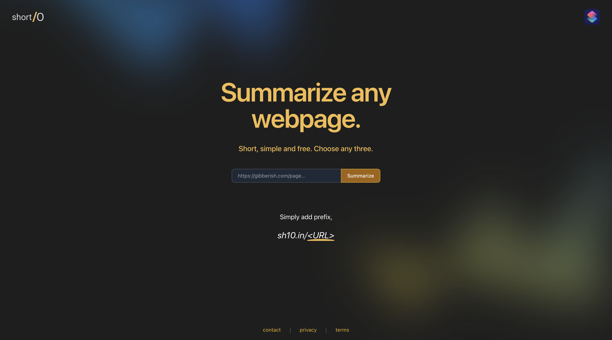
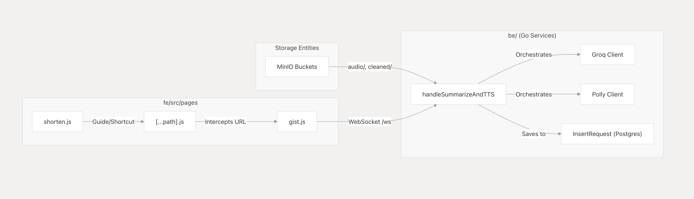
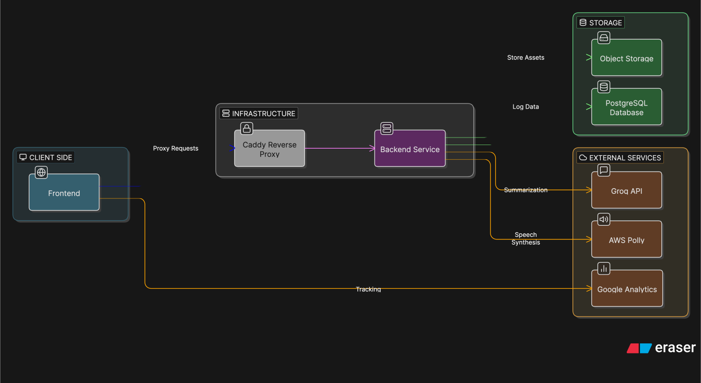

# Shorten 

## Overview
Shorten is a clean and a free web service that let users to summarize webpages by simply prepending that URL with `sh10.in/`

## Functionalities
### Web crawler & summarizer 
  Extract content from given URL and turn it into clean, structured markdown summary of 150-200 words via Groq AI.
### Text-to-speech
Generates text-to-speech audio which users can listen to using AWS Polly over WebSockets with word-level sync and on-page highlighting.
### Apple Shortcut
 Provides users an apple shortcut that gives functionality to summarize.
### Storage & object store
 PostgreSQL for metadata and analytics, MinIO for object storage.
### Observability 
Latency and traffic monitoring with PostgreSQL and Google Analytics.

## Tech Stack
| Layer       | Technology        | Role                                                                 |
|------------|------------------|----------------------------------------------------------------------|
| Frontend   | Next.js (React)  | Catch-all routing, UI rendering, and session management              |
| Backend    | Go               | High-concurrency processing, WebSocket handling, and API integration |
| AI/LLM     | Groq             | Rapid text summarization using Large Language Models                 |
| Speech     | AWS Polly        | Generating high-quality audio and speech-mark data for synchronization |
| Storage    | MinIO / S3       | Object storage for cleaned text, summaries, and audio files          |
| Database   | PostgreSQL       | Metadata storage for requests, feedback, and analytics               |
| Proxy      | Caddy            | TLS termination and routing for the frontend and backend services    |

## Entities

## Architecture

## License

This project is licensed under the MIT License - see the [LICENSE](LICENSE) file for details.